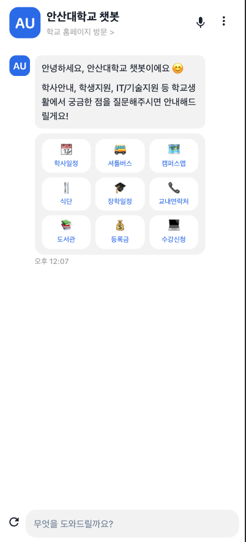

# 안산대 챗봇 백엔드 프로젝트 소개

- 안산대 챗봇은 안산대학교 학생들을 위한 챗봇 서비스입니다.
- 다른 대학교 챗봇들을 참고하여 안산대학교 챗봇을 만들어 보았습니다.
- 일반적인 대학교 챗봇과 비슷한 기능들(학사일정, 도서관, 기숙사, 학식 등등)을 제공합니다.
- 챗봇 엔진 직접 뛰울 능력이 없어 구글 챗봇 엔진 Dialogflow를 사용하였고 배포는 GCP에 하였습니다.

## 프론트엔드 프로젝트 링크
https://github.com/pcs9898/ansan-univ-chatbot-frontend

## 백엔드 프로젝트 제작 기간 📅 && 참여 인원 🧑‍🤝‍🧑

- 2023 11월 22일 ~ 2023 12월 5일 (2주)
- 백엔드 1명 (본인), Diaglogflow 1명 (팀원: 이형준)

## 작동 화면
#### 모바일 UI

#### PC UI

## 주요 기능 ✨

- FE로부터 채팅 메세지 혹은 이벤트(미리 diagflow에서 지정한 postback, 일종의 지정된 메뉴)를 rest api로 받아 Dialogflow로 전달해 Diagflow에서 indent macthcing 답변을 FE로 전달
- 제공 정보는 학사일정, 셔틀버스, 캠퍼스맵, 식단, 장학일정, 교내연락처, 도서관, 등록금 , 수강신청 등등 
- 만약 받아온 indent가 학식이라면 안산대학교 홈페이지에서 학식 정보를 크롤링하여 FE로 전달
- 학식 같은 경우 매일 변하기에 크롤링후 하루 단위로만 redis에 캐싱
- 다국어(영어) 지원

## 기술 스택 ⚒️

- Nestjs  
- Dialogflow
- Redis
- Cheerio
- GCP

## 프로젝트 회고 🤔

- 처음엔 파이썬 기반의 챗봇엔진을 활용하려 했으나 indent matching 능력 끌어올리는게 어려워 Dialogflow를 이용하였습니다, 미리 자연어처리 공부를 했었다면 좋았을 것 같습니다. 
- 0시 이후 처음 학식 정보를 요청한 경우에 크롤링후 캐싱했으나, 차라리 0시에 크론으로 매일 0시에 자동 크롤링하도록 하는게 더 좋을 것 같습니다.
- 학사 시스템에 접근 권한이 있다면 인증 후 개인화된 정보(예: 수업 시간표)도 제공할 수 있는데 현재는 단순 정보만 제공하니 아쉽습니다. 

[//]: # (# ansan-univ-chatbot-backend)

[//]: # ()
[//]: # (- [x] feature0/initialSetup)

[//]: # (- [x] feature1/dialogFlowService)

[//]: # ()
[//]: # (## ToDos)

[//]: # ()
[//]: # (- [x] crawling ansan univ site meal menu)

[//]: # (- [x] integrate redis)
